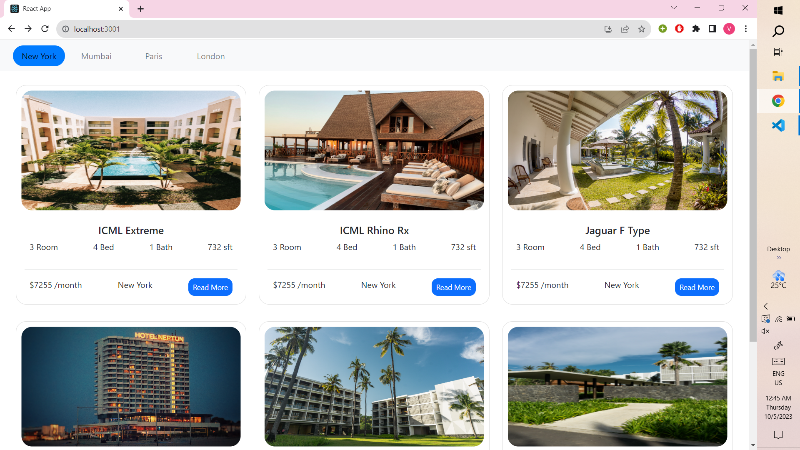
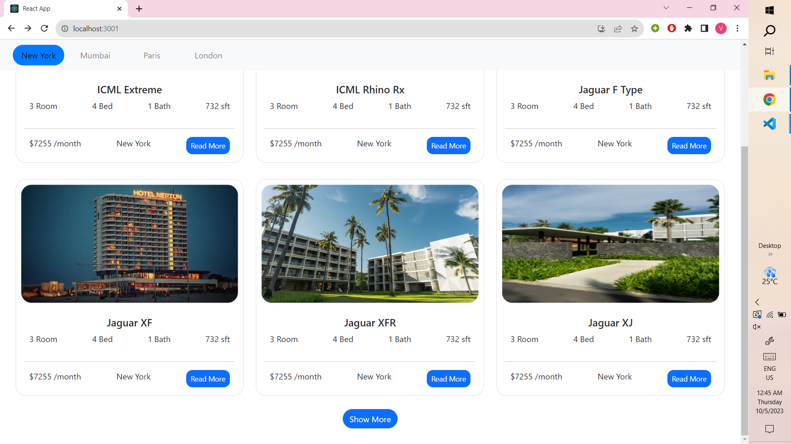
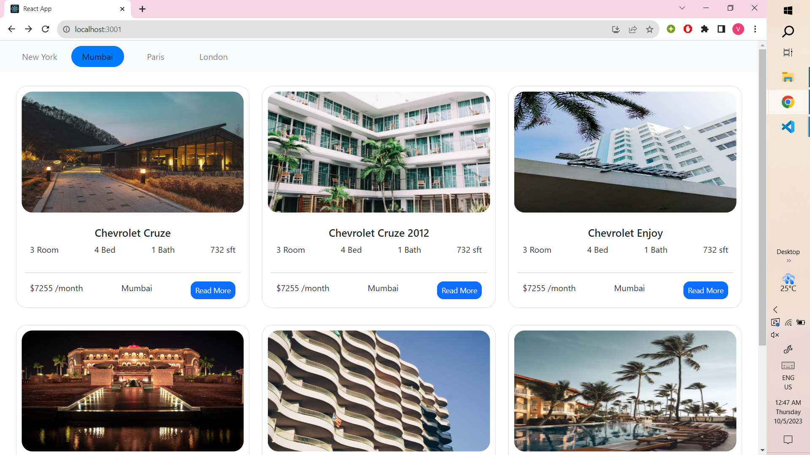
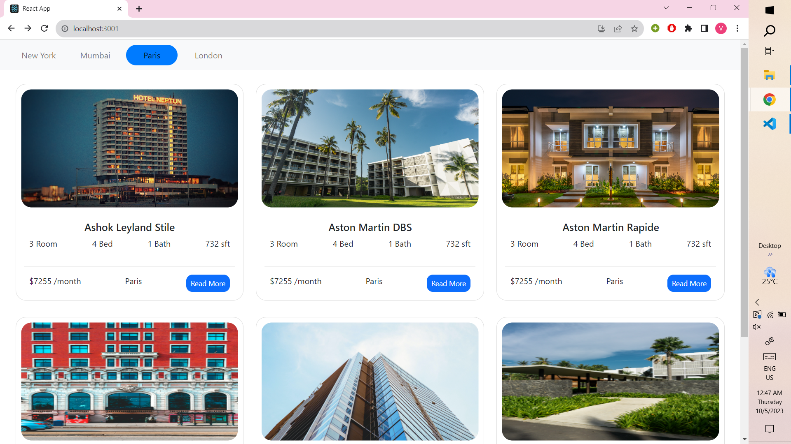

# Hotels Listing


### About the Project

Details of the Project can be found here [Details](https://drive.google.com/file/d/1n_kp-D_Yltl7Tr8PDzMfLaYyQtxDwyMG/view?usp=sharing)

## Getting Started

clone this repo using this command ```git clone https://github.com/vishal38722/hostel_listing.git```

### Installation

Inside the project directory run this command to install node modules  
                ```npm install```

### Run the Project
Inside the project directory run this command to run the project
                ```npm run start``` 


Here I have attached some screenshots of the webpages

#### Showing Hotels for New York


#### Showing Show More feature


#### Showing Hotels for Mumbai


#### Showing Hotels for Paris


#### Showing Hotels for London
